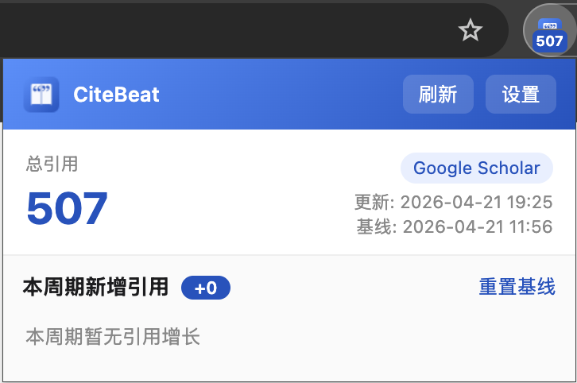
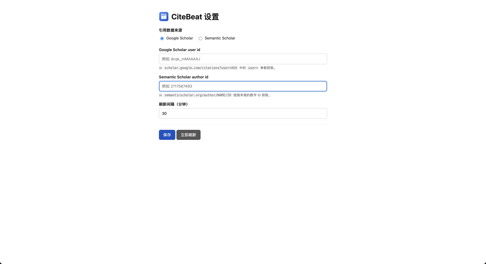

# CiteBeat

> 听见你引用的节拍。
> 一个极简的浏览器扩展，定时获取你的 Google Scholar / Semantic Scholar 总引用数，并一键查看本周期内引用有增长的论文。

## 功能

- 🔄 **定时抓取**：后台按设定间隔（默认 30 分钟）自动刷新引用数据
- 🔁 **双数据源可切换**：支持 Google Scholar 和 Semantic Scholar，任选其一
- 🔢 **徽章显示总引用**：工具栏图标直接显示最新总引用数（自动简写为 `12.3k`）
- 📈 **本周期新增引用**：点击图标可查看当前统计周期内引用数发生增长的论文列表（每篇论文 `+N` 引用），按增量降序排列
- 🕹 **手动开始新周期**：随时可把当前状态设为新统计周期的起点，重新开始统计
- 📅 **自动统计周期**：可选择手动、每周一、每月 1 号或每 N 天自动开始新周期
- 🗂 **轻量历史缓存**：总引用或论文级变化发生时，在本地记录总量快照和 Top 论文变动摘要
- 💾 **数据仅本地存储**：所有数据保存在浏览器本地 `chrome.storage.local`，不会上传到任何服务器

## 安装

### 开发者模式加载

1. 克隆本仓库：`git clone https://github.com/sci-m-wang/CiteBeat.git`
2. 在仓库目录运行 `./pack.sh`（会生成 `dist/unpacked/` 目录）
3. 打开 `chrome://extensions` 或 `edge://extensions`，启用"开发者模式"
4. 点"加载已解压的扩展程序"，选择 `dist/unpacked`
5. 首次安装会自动打开设置页

> 注意：不要直接加载仓库根目录。根目录下的 `_config.yml`（GitHub Pages 用）
> 以下划线开头，会被 Chromium 视为保留名并拒绝加载。`pack.sh` 会产出干净的扩展目录。

### 从 Chrome Web Store 安装

_（待上架后补充链接）_

## 使用

1. 点击扩展图标或右键 → "选项"，打开设置页
2. 选择数据来源（Google Scholar 或 Semantic Scholar）
3. 填入对应的作者 ID：
   - **Google Scholar user id**：个人主页 URL `scholar.google.com/citations?user=XXX` 中的 `user=` 参数
   - **Semantic Scholar author id**：作者页 URL `semanticscholar.org/author/NAME/ID` 末尾的数字 ID
4. （可选）调整刷新间隔和统计周期
5. 保存后会自动开始抓取。点击工具栏图标查看弹窗

## 弹窗界面

- **总引用**：来自当前数据源的最新总数
- **本周期新增引用 +N**：自本周期起点以来所有论文引用增长之和
- **论文列表**：只展示当前统计周期内引用数增加的论文，显示 `+N` 增量与当前总引用，点击标题直达论文页
- **引用减少 / 被合并**：单独列出引用下降或被数据源合并移除的论文，帮助解释总量差异
- **统计周期**：显示当前周期起点和模式；自动模式会在下一次成功刷新时开启新周期
- **开始新周期**：把当前状态设为新统计周期的起点，自动模式下也可手动使用
- **刷新**：立刻触发一次抓取，不必等下一次定时

## 权限说明

| 权限 | 用途 |
|---|---|
| `alarms` | 创建周期性刷新任务 |
| `storage` | 本地保存作者 ID、引用快照、统计周期起点和历史摘要 |
| `https://scholar.google.com/*` | 抓取本人公开的 Google Scholar 个人页 |
| `https://api.semanticscholar.org/*` | 调用 Semantic Scholar 官方 Graph API |

扩展不会读取其他任何页面，不会与第三方服务器通信，也不会收集任何用户识别信息。详见 [PRIVACY.md](PRIVACY.md)。

## 截图

## 已知限制

- Google Scholar 在高频抓取下可能会触发临时验证码，建议刷新间隔 ≥ 15 分钟
- Semantic Scholar 作者页与 API 口径偶有差异，已自动取二者较大值
- Google Scholar 论文列表通过分页抓取；若页面结构变化或被临时限制访问，论文级增长可能暂时无法完整归因

## 参与贡献

欢迎 issue / PR。小工具、轻维护，任何改进都欢迎：

- 报 bug：issue 附上数据源、作者 ID（若方便）、service worker console 的日志
- 提新功能前，先开 issue 聊一下思路

## 许可证

基于 [MIT](LICENSE) 协议开源 © 2026 KinaMind。

人-Agent 协作归属与溯源元数据遵循 [SymPro 0.1](https://github.com/kinamind/SymPro)
协议，详见仓库内 `.sympro/` 目录。SymPro 作为 MIT 的补充，不改变代码本身的许可。
